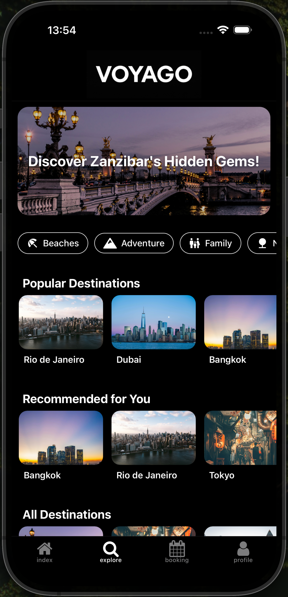
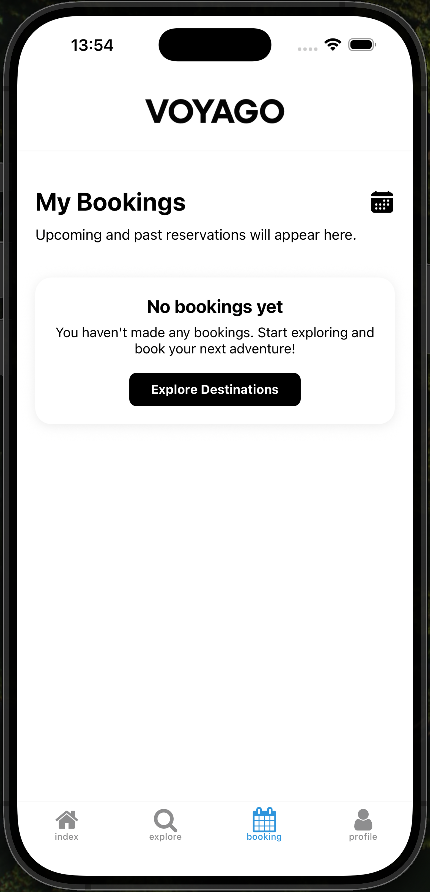
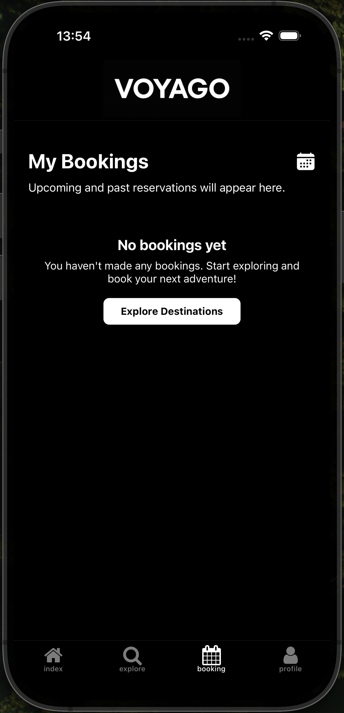
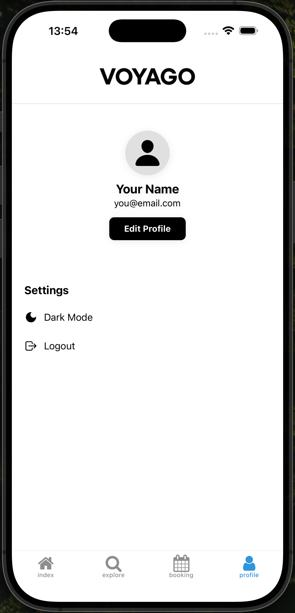
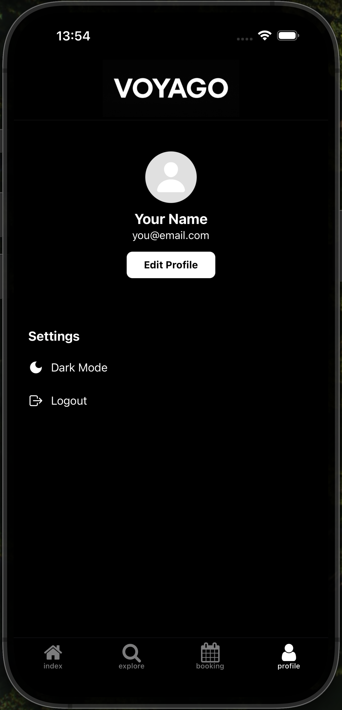
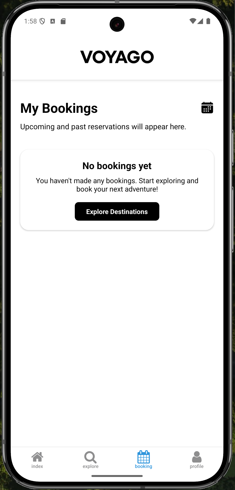
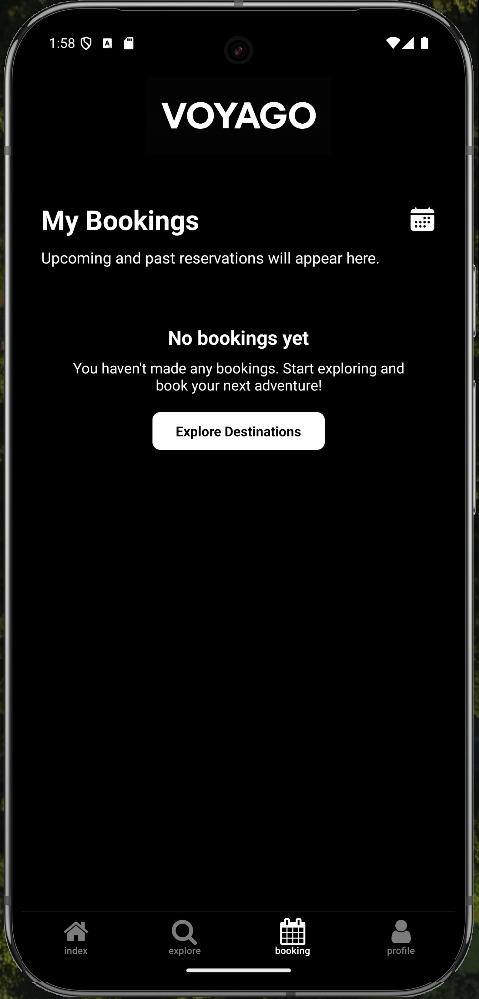
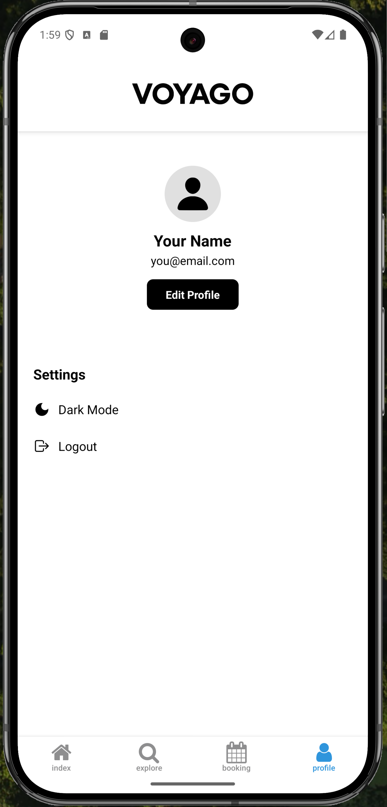
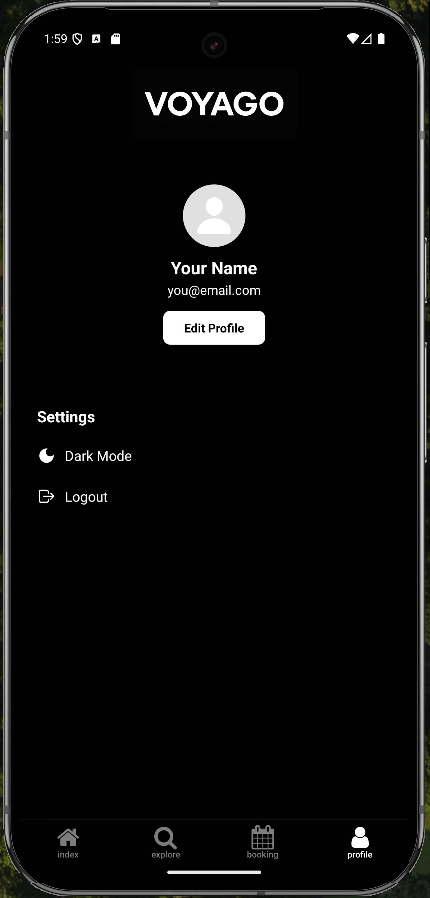

# Voyago — Travel Booking App UI

**Voyago** is a modern travel booking app UI built with **React Native (Expo)** and **TypeScript**. It features a clean architecture, beautiful UI, and a smooth onboarding-to-booking flow.

---

## Features

- **Onboarding:** Welcome screen with app intro
- **Authentication:** Demo login/signup (in-memory, no backend)
- **Home:** Destination cards, search, filter chips, animated header
- **Explore:** Category chips, hero banner, popular/recommended carousels
- **Booking:** Booking screen (demo, no real booking)
- **Profile:** Avatar, email, settings (dark mode toggle, logout)
- **Destination Modal:** Details, images, costs, similar destinations
- **Splash Screen:** Custom splash, auto-routes to onboarding/login
- **Dark Mode:** Full support, auto-detects system theme
- **Smooth Animations:** Uses React Native Reanimated

---

## Tech Stack

| Tool                             | Purpose                          |
| -------------------------------- | -------------------------------- |
| **Expo**                         | React Native framework           |
| **TypeScript**                   | Type safety                      |
| **React Navigation/Expo Router** | Navigation & routing             |
| **React Native Reanimated**      | Animations                       |
| **@expo/vector-icons**           | Icon set                         |
| **AsyncStorage**                 | Local storage (onboarding state) |

---

## Folder Structure

```
Voyago/
├── app/
│   ├── _layout.tsx
│   ├── +html.tsx
│   ├── +not-found.tsx
│   ├── login.tsx
│   ├── signup.tsx
│   ├── onboarding.tsx
│   ├── splash.tsx
│   ├── modal.tsx
│   └── (tabs)/
│       ├── _layout.tsx
│       ├── index.tsx      # Home
│       ├── explore.tsx
│       ├── booking.tsx
│       └── profile.tsx
├── assets/
│   ├── fonts/
│   │   └── SpaceMono-Regular.ttf
│   └── images/
│       ├── voyago(black).jpeg/png
│       ├── voyago(white).jpeg/png
│       ├── city3.jpg ...
│       └── ...
├── components/
│   ├── CompactHeader.tsx
│   ├── EditScreenInfo.tsx
│   ├── ExternalLink.tsx
│   ├── LogoTitle.tsx
│   ├── StyledText.tsx
│   ├── Themed.tsx
│   └── ...
├── constants/
│   └── Colors.ts
├── src/
│   ├── data/
│   │   └── destinations.ts
│   └── utils/
│       └── useAppColors.ts
├── app.json
├── package.json
├── tsconfig.json
└── README.md
```

---

## Getting Started

```bash
# Clone the repo
git clone https://github.com/<your-username>/voyago.git

cd voyago
npm install
npx expo start
```

---

## Notes

- **Demo only:** No backend, bookings and auth are in-memory only.
- **Destinations:** See `src/data/destinations.ts` for demo data.
- **Splash/Onboarding:** First launch shows onboarding, then login/signup.
- **Dark mode:** Auto-detects system theme, can toggle in profile.
- **Custom splash:** Uses `voyago(black|white).png` for splash.
- **Tested on:** Expo Go (iOS/Android/web)

---

## Screenshots (COMING SOON!)

### 📱 iOS Screenshots

<p float="left">
	
	
	
    
</p>

<p float="left">
	
	
</p>

<p float="left">
	
	
</p>

<p float="left">
	
	
</p>

---

### 🤖 Android Screenshots

<p float="left">
	
	
	
    
</p>

<p float="left">
	
	
</p>

<p float="left">
	
	
</p>

<p float="left">
	
	
</p>
